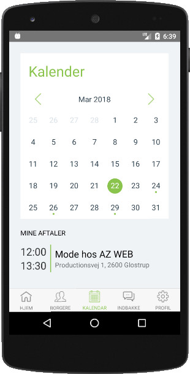

  

# Required tools #

- [NodeJS](https://nodejs.org/en/) (I'm using v9.8.0)
- [Yarn](https://yarnpkg.com/en/) (v1.5.1 is used here), npm refused to install dependencies properly
- [React Native CLI](https://www.npmjs.com/package/react-native-cli)
- [Python 2](https://www.python.org/downloads/) (v2.7.14)
- [JDK 8](http://www.oracle.com/technetwork/java/javase/downloads/jdk8-downloads-2133151.html)
- [Android Studio](https://developer.android.com/studio/index.html) (use the latest one)

# How to install #

Just read & follow [this instructions](https://facebook.github.io/react-native/docs/getting-started.html) to wire up the abovementioned soft

Once you've installed all needed tools & clone the repo - run `yarn` in order to pull all dependencies (you can still use npm if you want to: `npm install`)

# How to launch the app #

And then type `react-native run-android` or `react-native run-ios` to launch the app in Android or IOS emulator respectively

> NOTE: in order to create a brand new react-native app run `react-native init <your-project-name>` (this is how I did the initial deployment)

# How to build apk #

Please refer to the [official guide](https://facebook.github.io/react-native/docs/signed-apk-android.html)